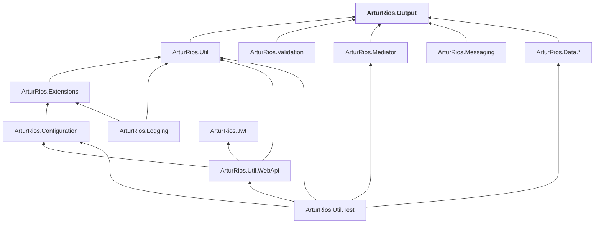

# Dotnet Libraries

[](https://artur-rios.github.io/dotnet-libraries)
[](./LICENSE)

The index of the **ArturRios** .NET library family — twelve libraries, twenty NuGet packages, one set of
conventions. This repository holds no code: it is the map, and the source of the site at
<https://artur-rios.github.io/dotnet-libraries>.

- 📚 **Site:** <https://artur-rios.github.io/dotnet-libraries>
- 🧩 **Dependency graph:** <https://artur-rios.github.io/dotnet-libraries/docs/dependencies/>
- 📐 **Shared patterns:** <https://artur-rios.github.io/dotnet-libraries/docs/patterns/>

## The libraries

All target **.NET 10 (`net10.0`)** and are MIT licensed. Each lives in its own repository, with its own
tests, its own Docsy documentation site and its own release cadence.

| Library | Repository | Docs | Package(s) |
|---|---|---|---|
| Output | [dotnet-output](https://github.com/artur-rios/dotnet-output) | [Docs](https://artur-rios.github.io/dotnet-output) | [](https://www.nuget.org/packages/ArturRios.Output) |
| Util | [dotnet-util](https://github.com/artur-rios/dotnet-util) | [Docs](https://artur-rios.github.io/dotnet-util) | [](https://www.nuget.org/packages/ArturRios.Util) |
| Extensions | [dotnet-extensions](https://github.com/artur-rios/dotnet-extensions) | [Docs](https://artur-rios.github.io/dotnet-extensions) | [](https://www.nuget.org/packages/ArturRios.Extensions) |
| Configuration | [dotnet-configuration](https://github.com/artur-rios/dotnet-configuration) | [Docs](https://artur-rios.github.io/dotnet-configuration) | [](https://www.nuget.org/packages/ArturRios.Configuration) |
| Logging | [dotnet-logging](https://github.com/artur-rios/dotnet-logging) | [Docs](https://artur-rios.github.io/dotnet-logging) | [](https://www.nuget.org/packages/ArturRios.Logging) |
| JWT | [dotnet-jwt](https://github.com/artur-rios/dotnet-jwt) | [Docs](https://artur-rios.github.io/dotnet-jwt) | [](https://www.nuget.org/packages/ArturRios.Jwt) |
| Validation | [dotnet-validation](https://github.com/artur-rios/dotnet-validation) | [Docs](https://artur-rios.github.io/dotnet-validation) | [](https://www.nuget.org/packages/ArturRios.Validation) |
| Mediator | [dotnet-mediator](https://github.com/artur-rios/dotnet-mediator) | [Docs](https://artur-rios.github.io/dotnet-mediator) | [](https://www.nuget.org/packages/ArturRios.Mediator) |
| Messaging | [dotnet-messaging](https://github.com/artur-rios/dotnet-messaging) | [Docs](https://artur-rios.github.io/dotnet-messaging) | [](https://www.nuget.org/packages/ArturRios.Messaging) |
| Data | [dotnet-data](https://github.com/artur-rios/dotnet-data) | [Docs](https://artur-rios.github.io/dotnet-data) | [9 packages](https://artur-rios.github.io/dotnet-libraries/docs/packages/#data-access) |
| Web API Util | [dotnet-webapi-util](https://github.com/artur-rios/dotnet-webapi-util) | [Docs](https://artur-rios.github.io/dotnet-webapi-util) | [](https://www.nuget.org/packages/ArturRios.Util.WebApi) |
| Test Util | [dotnet-test-util](https://github.com/artur-rios/dotnet-test-util) | [Docs](https://artur-rios.github.io/dotnet-test-util) | [](https://www.nuget.org/packages/ArturRios.Util.Test) |

## How they depend on each other

Family dependencies only; third-party packages are listed on each library's own site.



`ArturRios.Output` is the root — almost everything needs it in its signatures. `ArturRios.Jwt` is
deliberately standalone. The full graph, including the nine `Data` packages, is on the
[dependencies page](https://artur-rios.github.io/dotnet-libraries/docs/dependencies/).

## The patterns

These are the ideas that repeat across the family; the
[patterns page](https://artur-rios.github.io/dotnet-libraries/docs/patterns/) covers them in full.

1. **Outputs, not exceptions.** Anything that can fail for an expected reason returns a `ProcessOutput`,
   `DataOutput<T>` or `PaginatedOutput<T>` envelope. Validation failures, missing records and
   optimistic-concurrency conflicts arrive as errors *on the result*; exceptions are for genuine defects.
2. **One capability, one package.** Nothing is bundled for convenience. Even within `ArturRios.Data`,
   each backend is a separate package, so SQLite support does not drag in the MongoDB or AWS SDKs.
3. **A core plus interchangeable providers.** `*.Core` packages define the abstraction and provider
   packages supply the implementations — `Relational.Core` with PostgreSQL / MySQL / SQLite / Dapper,
   `Export` with `Export.Excel`, `Configuration` with its source providers.
4. **Composition over the built-in container.** Registration always uses the standard
   `IServiceCollection`. `ArturRios.Mediator` resolves each handler from a *fresh DI scope*, so scoped
   dependencies like a `DbContext` are isolated per execution.
5. **Validation as a first-class result.** `FluentValidator<T>` turns FluentValidation results into a
   `string[]` or an `Output` envelope, behind an injectable `IFluentValidator<T>`.
6. **Configuration from layered sources.** `ConfigurationLoader` composes JSON, environment variables and
   `.env` files under one rule: later sources override earlier ones — and the same loader backs both the
   web API startup and the functional test base.
7. **Diagnostics that cross process boundaries.** Caller info and trace IDs in `ArturRios.Logging`; W3C
   `traceparent` propagation through `ArturRios.Util.WebApi` middleware and outgoing calls.
8. **Given / When / Then tests.** xUnit throughout, with `ArturRios.Util.Test` supplying assertions,
   in-memory fakes and environment-aware attributes.
9. **Identical repository layout.** `src/`, `tests/`, `docs/`, `README.md`, `LICENSE`.
10. **Identical CI.** `run-tests.yml` on pushes and PRs, `build-docs-and-coverage-report.yml` deploying
    docs and coverage to GitHub Pages, `publish-package.yml` packing and pushing on a tag.
11. **Consistent packaging metadata.** `net10.0`, MIT, XML docs, an `ArturRios.*` package id, and
    independent per-package versions — there is no lockstep family version.

## Building this site

The site is Hugo with the [Docsy](https://www.docsy.dev/) theme, installed as an npm package.

```bash
cd docs
npm install
npm run serve
```

`npm run build` produces the static site in `docs/public`. Pushing to `main` triggers
[`build-docs.yml`](.github/workflows/build-docs.yml), which builds it and deploys to the `gh-pages`
branch.

## Contributing

Open the issue or pull request on the repository of the library it concerns. Anything about the family as
a whole — a wrong dependency edge, a pattern worth documenting — belongs here.

## Legal

MIT — see [LICENSE](./LICENSE). Copyright © Artur Rios.
