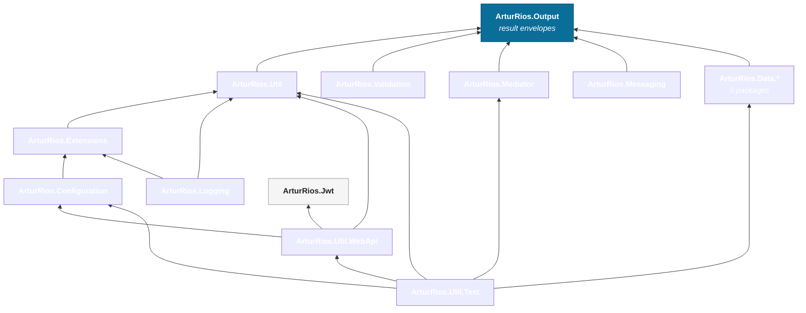
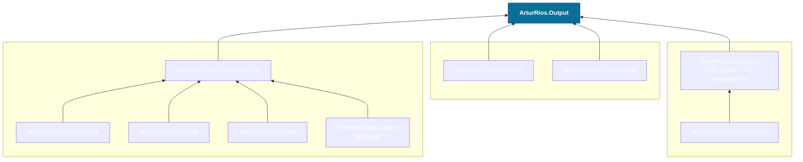
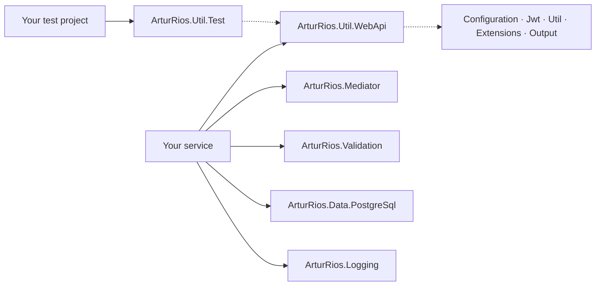

Only dependencies **within the family** are shown. Third-party dependencies (FluentValidation, EF Core,
Dapper, the MongoDB and AWS SDKs, xUnit, `Microsoft.Extensions.*`) are listed on each library's own page.

## The whole family

`ArturRios.Output` is the root: it defines the envelopes every fallible operation returns, and it depends
on nothing else in the family. `ArturRios.Util.Test` is the leaf that pulls in the most, because a test
helper has to know about everything it fakes.

`ArturRios.Jwt` is deliberately standalone — it depends on nothing in the family, so a service can issue
and validate tokens without adopting anything else.

## Inside ArturRios.Data

The `Data` repository ships nine packages so you install only the backend you use. The relational
packages share a common core; MongoDB, DynamoDB and the export writers are independent of it.

## Dependency table

Read an arrow as *"depends on"*. Versions are the ones currently referenced in each project file, and
move independently of one another.

| Package | Depends on (family only) |
|---|---|
| `ArturRios.Output` | — |
| `ArturRios.Jwt` | — |
| `ArturRios.Util` | `ArturRios.Output` |
| `ArturRios.Extensions` | `ArturRios.Util` |
| `ArturRios.Configuration` | `ArturRios.Extensions` |
| `ArturRios.Logging` | `ArturRios.Extensions`, `ArturRios.Util` |
| `ArturRios.Validation` | `ArturRios.Output` |
| `ArturRios.Mediator` | `ArturRios.Output` |
| `ArturRios.Messaging` | `ArturRios.Output` |
| `ArturRios.Data.Relational.Core` | `ArturRios.Output` |
| `ArturRios.Data.PostgreSql` | `ArturRios.Data.Relational.Core` |
| `ArturRios.Data.MySql` | `ArturRios.Data.Relational.Core` |
| `ArturRios.Data.Sqlite` | `ArturRios.Data.Relational.Core` |
| `ArturRios.Data.Dapper` | `ArturRios.Data.Relational.Core` |
| `ArturRios.Data.MongoDb` | `ArturRios.Output` |
| `ArturRios.Data.DynamoDb` | `ArturRios.Output` |
| `ArturRios.Data.Export` | `ArturRios.Output` |
| `ArturRios.Data.Export.Excel` | `ArturRios.Data.Export` |
| `ArturRios.Util.WebApi` | `ArturRios.Configuration`, `ArturRios.Jwt`, `ArturRios.Util` |
| `ArturRios.Util.Test` | `ArturRios.Configuration`, `ArturRios.Data.Relational.Core`, `ArturRios.Mediator`, `ArturRios.Util`, `ArturRios.Util.WebApi` |

## A typical service

A web API built on the family usually ends up with this stack — and picks up the rest transitively.

